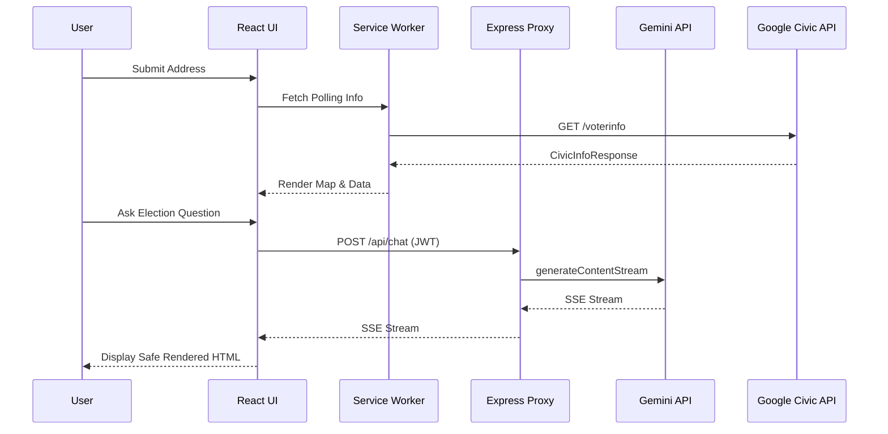

# Architecture Documentation

## Folder Structure

```
/
├── server/
│   └── index.ts          # Express Server with Security & Gemini integrations
├── src/
│   ├── components/       # React Presentation and Container Components
│   ├── hooks/            # Custom Hooks (useGemini, useTranslation)
│   ├── services/         # API Service Integrations (SOLID)
│   ├── types/            # TypeScript Interface Definitions
│   ├── utils/            # Utilities (IndexedDB, Crypto)
│   ├── workers/          # Web Workers for heavy computations
│   ├── App.tsx           # Main Application Routing and Layout
│   └── main.tsx          # Application Entry Point
├── docs/                 # Documentation
├── e2e/                  # Playwright E2E Tests
└── .github/workflows/    # CI/CD Pipelines
```

## Data Flow

1. **User Action**: The user submits a question via `ChatInput.tsx`.
2. **State Management**: `useGemini.ts` updates the React state to show the message.
3. **Local Cache Check**: IndexedDB (`utils/idb.ts`) checks if a response hash exists.
4. **API Call**: If no cache, the client calls `/api/chat` with an anonymous JWT.
5. **Server Validation**: Express middleware authenticates, limits rate, and validates input.
6. **AI Processing**: Google Generative AI streaming generates the response.
7. **Client Rendering**: `ChatMessages.tsx` renders the response safely using `DOMPurify`.

## API Integration Diagram


